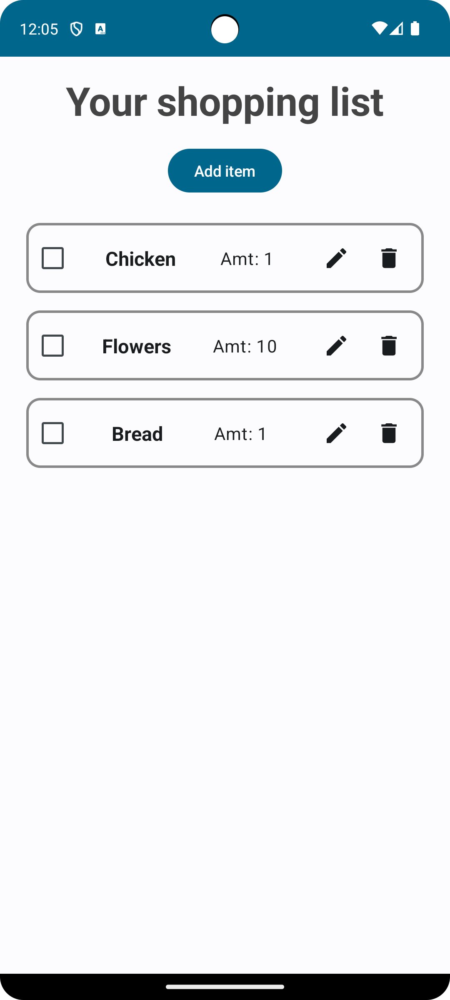
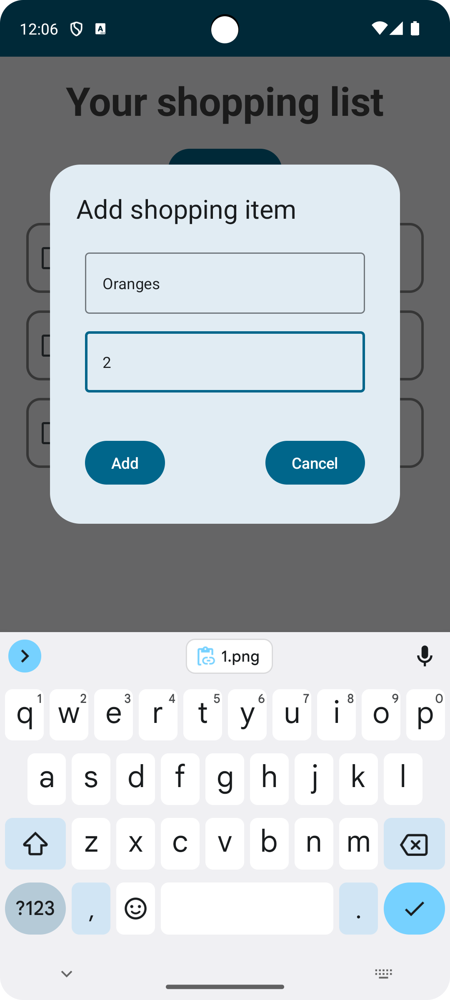
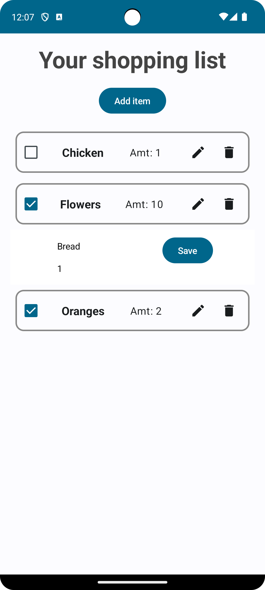

# Shopping List App

The Shopping List app is a simple tool for managing the list of products you want to buy while shopping. 
The goal of the application is to facilitate the organization and planning of shopping by allowing users to create, edit, and delete items on the shopping list.

**Main features**:
- Adding products: Users can add products to the shopping list by entering the product name and quantity.
- Editing and deleting products: Ability to edit the product name or quantity and delete products from the list.
- Marking products as purchased: Users can mark products as purchased to easily track what has already been bought.
  
&nbsp;
 
## 💡 Technologies


&nbsp;
 
## 📺  Screenshots

<div style="display: flex;">
  
  
  
</div>

&nbsp;
 
## 💿 Installation

1. Clone this repository to your local machine:
```
git clone https://github.com/kSuska1/ShoppingListApp.git
```
2. Open Android Studio and select "Open an existing Android Studio project." Navigate to the location where you cloned the repository and select the folder containing the build.gradle file.

3. After opening the project in Android Studio, build the project and run the application on an emulator or a target device.


&nbsp;

## 🙋🏻‍♀️ Feel free to contact me
If you encounter any issues or have questions, please feel free to contact me via [](mailto:karolina1101suska@gmail.com)
 or [](https://www.linkedin.com/in/twójprofillinkedin)
.
